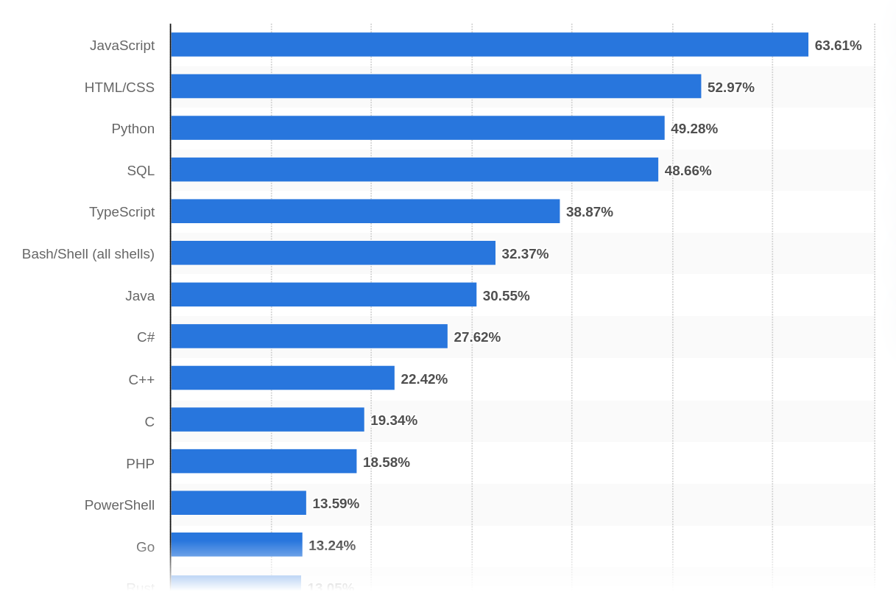

# Introduction to Python

----

## What is Python?

- Python is a high-level, interpreted programming language.
- Known for its clear syntax and readability.
- Developed by Guido van Rossum in the late 1980s.


----

## Popularity and Usage

- One of the most popular programming languages in the world.
- Used in web development, data science, artificial intelligence, and more.
- Loved by beginners and professionals alike.

----

## Most used programming languages 2023



----

## Interpreted vs. Compiled Languages

- Python is an interpreted language, meaning code is executed line by line.
- Compiled languages (like C#) convert code into machine language before execution, leading to faster runtime.
- Each approach has its advantages: Python for ease of use and rapid development, compiled languages for performance.

----

## Why Learn Python?

- Easy to learn for beginners.
- Extensive libraries and frameworks.
- Strong community support and vast resources.
- Great for data science and machine learning.

---

# Setting Up the Environment

----

## Installing Python

- Download Python from the [official website](https://www.python.org/downloads/).
- Choose the version suitable for your operating system.
- Follow the installation guide, ensuring that Python is added to your system's PATH.

----

## Introduction to VS Code

- VS Code is a free, open-source editor by Microsoft.
- Highly customizable and supports numerous programming languages.
- Extensive marketplace for extensions, including Python support.


----

## Setting up Python in VS Code

- Install VS Code from the [official site](https://code.visualstudio.com/).
- Open VS Code and navigate to the Extensions view (`Ctrl+Shift+X`).
- Search for and install the [‘Python’ extension](https://marketplace.visualstudio.com/items?itemName=ms-python.python) by Microsoft.

----

## Creating Your First Python Project

- Open VS Code and create a new folder for your project.
- Create a new Python file (`.py` extension).
- Write a simple Python script, like printing a message.

----

## Running Python Code in VS Code

- Open your Python file in VS Code.
- You can run the script by right-clicking in the editor and selecting 'Run Python File in Terminal'.
- Observe the output in the integrated terminal.

---

# Hello World (Your First Python Program)

----

## Hello World

- The first program you write in any programming language is usually a simple message.
- In Python, this is done using the `print()` function.
- Create a new Python file using VS Code and write the following code:

```python
print("Hello World!")
```

----

## Hello World

- Save the file as `hello_world.py`.
- Run the script by right-clicking in the editor and selecting 'Run Python File in Terminal'.
- Observe the output in the integrated terminal.

----

## Hello World

- You can also run the script by opening the integrated terminal and typing 

```bash
python hello_world.py
```

- This is the preferred method for running Python scripts.

----

## Comments

- Comments are used to explain code and make it more readable.
- In Python, comments are created using the `#` symbol.
- Comments are ignored by the interpreter.

```python
# This is a comment
print("Hello World!") # This is also a comment
```

---

# Variables and Data Types

----

## Introduction to Variables

- Variables are used to store data in a program.
- In Python, you can create a variable by assigning a value to it.
- The value can be of different data types, such as numbers, strings, or booleans.
- In Python you don't need to specify the data type of a variable like in other languages.

----

## Variable Assignment

- You can assign a value to a variable using the assignment operator (`=`).
- The value can be a literal or the result of an expression.
- Variables can be reassigned with a new value at any time.

```python
# Assigning a number to a variable
x = 5
# now 5 is stored in x
```

----

## Numeric Data Types

- Python supports various numeric data types, including integers (`int`), floating-point numbers (`float`), and complex numbers (`complex`).
- You can perform arithmetic operations on numeric data types, such as addition, subtraction, multiplication, and division.

```python[|1-2|3|4|]
a = 5
b = 2.5
result = a + b
print(result) # 7.5
```

----

## String Data Type

- Strings are sequences of characters enclosed in single or double quotes.
- You can perform various operations on strings, such as concatenation, slicing, and formatting.
- Python provides a rich set of string manipulation methods.

```python[|1-2|3|]
firstname = "Alexander"
lastname = "Kornfellner"
fullname = firstname + " " + lastname # concatenation
```

----

## Boolean Data Type

- Boolean data type represents truth values, either `True` or `False`.
- Boolean values are often used in conditional statements and logical operations.
- Python provides logical operators, such as `and`, `or`, and `not`, for working with boolean values.

```python
is_valid = True
is_admin = False
``````

----

## Type Conversion

- Python allows you to convert data from one type to another.
- This can be done using built-in functions like `int()`, `float()`, `str()`, and `bool()`.
- Type conversion is useful when you need to perform operations on different data types.

```python[|1-2|4-5|]
x = "5" # this is a string!
y = int(x) # convert to integer

name = "Alex"
z = int(name) # this will cause an error
```

----

## Variable Naming Rules

- Variable names in Python can contain letters, numbers, and underscores.
- They must start with a letter or an underscore.
- Variable names are case-sensitive.
- Avoid using reserved keywords as variable names.
- in good practice variable names should be descriptive and writte in [`snake_case`](https://en.wikipedia.org/wiki/Snake_case)

----

## Variable Scope

- The scope of a variable determines where it can be accessed in a program.
- In Python, variables have either global or local scope.
- Global variables can be accessed from anywhere in the program.
- Local variables are defined within a specific block or function.

---

# Operators and Expressions

- Operators are symbols that perform operations on operands.
- Python supports various types of operators, such as arithmetic, assignment, comparison, logical, and bitwise operators.
- Expressions are combinations of operators, operands, and variables that evaluate to a value.

----

## Arithmetic Operators

- Arithmetic operators are used to perform mathematical operations on numeric data types.
- Python supports the following arithmetic operators:
    - `+` Addition
    - `-` Subtraction
    - `*` Multiplication
    - `/` Division
    - `%` Modulus
    - `**` Exponentiation
    - `//` Floor division

----

## Assignment Operators

- Assignment operators are used to assign values to variables.
- Python supports the following assignment operators:
    - `=` Assign
    - `+=` Add and assign
    - `-=` Subtract and assign
    - `*=` Multiply and assign
    - `/=` Divide and assign

----

## Comparison Operators

- Comparison operators are used to compare values.
- Python supports the following comparison operators:
    - `==` Equal to
    - `!=` Not equal to
    - `>` Greater than
    - `<` Less than
    - `>=` Greater than or equal to
    - `<=` Less than or equal to

----

## Logical Operators

- Logical operators are used to combine boolean values and perform logical operations.
- Python supports the following logical operators:
    - `and` Logical AND
    - `or` Logical OR
    - `not` Logical NOT

----

## Precedence and Associativity

- Operators in Python have different precedence levels, which determine the order of evaluation.
- Parentheses can be used to override the default precedence.
- Operators with the same precedence are evaluated from left to right, unless otherwise specified.

----

## Expressions

- Expressions are combinations of operators, operands, and variables that evaluate to a value.
- Python supports a wide range of expressions, including arithmetic expressions, logical expressions, and conditional expressions.

---

# Code Blocks

----

## Introduction to Code Blocks

- Code blocks are used to group statements together.
- In Python, code blocks are defined using indentation.
- All statements within a code block must be indented by the same amount.

----

## Code Blocks (Example)

```python[|2-3|]
if x > 5:
    print("x is greater than 5")
    print("x is a positive number")
```

---

# Conditions


----

## Understanding Conditional Statements

- Conditional statements allow you to execute different code based on certain conditions.
- The `if` statement is the simplest form of conditional execution.
- It evaluates a condition and executes the code block if the condition is true.

```python[|2|3|]
x = 10
if x > 5:
    print("x is greater than 5")
```

----

## The `if-else` Statement

- An `else` statement can follow an `if` statement.
- This is used to handle the case where the `if` condition is false.

```python[|2-3|4-5|]
y = 3
if y > 5:
    print("y is greater than 5")
else:
    print("y is not greater than 5")

```

----

## The `elif` Statement

- `elif` (short for else if) is used for multiple conditions.

```python[|2-3|4-5|6-7|]
z = 7
if z > 10:
    print("z is greater than 10")
elif z > 5:
    print("z is greater than 5 but not greater than 10")
else:
    print("z is 5 or less")

```

----

## Nested Conditional Statements

- You can nest `if` statements within each other for more complex conditions.

```python[|1-2|3|4-5|6-7|]
a = 10
b = 20
if a > 5:
    if b > 15:
        print("a > 5 and b > 15")
    else:
        print("a > 5 but b <= 15")

```

----

## Conditional Expressions (Ternary Operators)

- Python supports conditional expressions, which are a compact way to use `if-else`` statements.

```python[|2|]
age = 18
status = "adult" if age >= 18 else "minor"
print(status)
```

